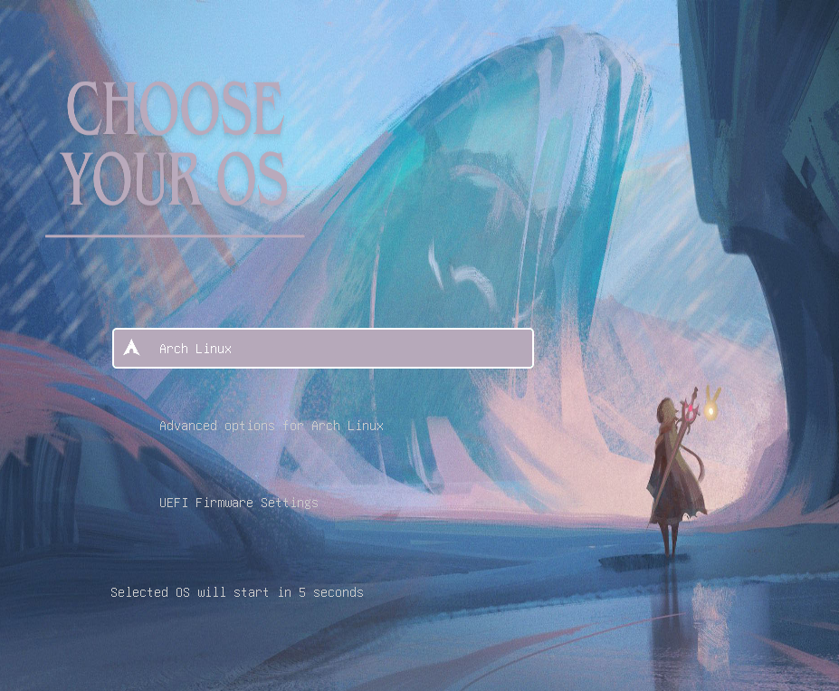

###  Contents 


  - <b>[Installation](#installation)</b>

## Installation

- Open your terminal
- clone the repository

```
  git clone https://github.com/DerJimno/gacha-grub-theme.git
```

- cd to the repo, copy the desired theme directory (genshin example):

```
  sudo cp -r genshin /usr/share/grub/themes
```
>In case you use Arch/Debian `sudo cp -r genshin /boot/grub/themes`

- Then use your favorite editor to add the name of the grub theme:

```
sudo nano /etc/default/grub
```

```
GRUB_THEME="/boot/grub/themes/genshin/theme.txt"
```

- Update grub

```
sudo grub-mkconfig -o /boot/grub/grub.cfg
```

- Reboot your pc

```
reboot
```

## Preview theme
1. genshin
<div align="center" style="display:inline">

</div>

2. wuwa (cartethiya)
<div align="center" style="display:inline">

</div>


